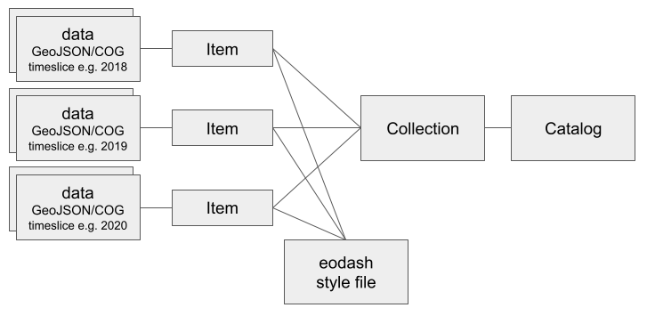
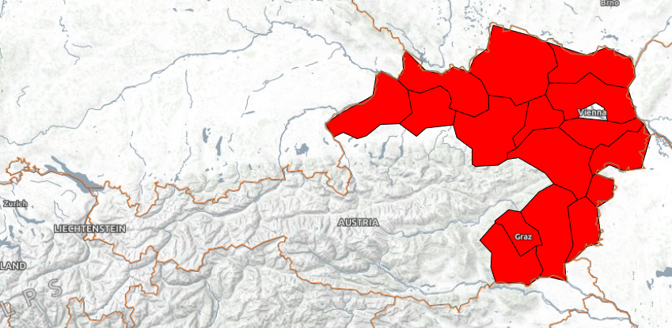
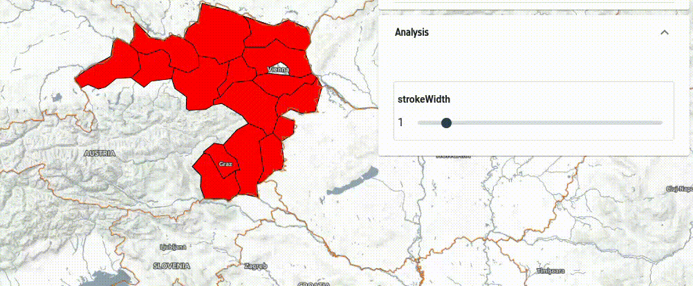
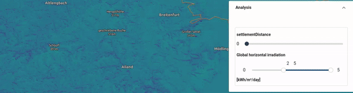

# Data configuration

An eodash instance expects to load its content from a STAC catalog. This catalog can be generated using the [eodash_catalog](https://github.com/eodash/eodash_catalog). As can be seen in the [catalog wiki](https://github.com/eurodatacube/eodash-catalog/wiki/Resource) there are multiple services supported.

We consider eodash to be a data integrator, so we find a "serverless" approach for data integration to be a great opportunity to not require more complex setups when wanting to share your data, apart from making them reachable online. For this we want to give explanations and examples of how this can be done for raster and vector data.
Currently we support Cloud Optimized GeoTIFFs (COGs) for raster and GeoJSON files for vector data. We want to support cloud optimized formats for vector data as soon as possible.

For both data types we wanted to introduce a shared language that gives the user the tools to fully describe how they should be rendered and interacted with. This is achieved by using a style JSON configuration file that utilizes the languages of [OpenLayers flat style](https://openlayers.org/en/latest/apidoc/module-ol_style_flat.html) as well as [JSON Form](https://github.com/jsonform/jsonform/wiki#using-json-schema-to-describe-your-data-model) definition language as extended by the EOxElement [eox-jsonform](https://eox-a.github.io/EOxElements/?path=/docs/elements-eox-jsonform--docs).
The style reference for STAC as a possible extension is being discussed [here](https://github.com/radiantearth/stac-spec/issues/1284). We currently take the proposed 3B approach.

Following is the catalog structure that would be generated when using the catalog creation helper tool.



Datasets can be referenced as assets within one item (i.e. TimeEntry) and then utilized as part of the style. Let's look at some examples.

## Vector data

Here is an example configuration for the catalog tool to add a geojson:

```yaml
Name: example_collection
Title: Example collection for vector data
EodashIdentifier: exmpl1
Description: This can be **markdown** text
Resources:
    - Name: GeoJSON source
      Style: https://location.of/vector_style.json
      Bbox: [9.27, 46.2, 17.3, 49.2]
      TimeEntries:
        - Time: "2024"
          Assets:
            - Identifier: vector_data
              File: https://location.of/file.json

```

Let's now look at the style definition options. Firstly we can explore the [flat style definition](https://openlayers.org/en/latest/apidoc/module-ol_style_flat.html) of OpenLayers. Here is a very basic example of how to style some things:
```json
{
    "fill-color": "red",
    "stroke-color": "black",
    "stroke-width": 1
}
```




In order to define interaction options for the user this can be extended with variables, combined with JSON Form definition. To continue the example, let's say, we would like the user to be able to change the stroke-width with a slider, we can extend the style file like this:
```json
{
    "variables": {
        "strokeWidth": 1
    },
    "fill-color": "red",
    "stroke-color": "black",
    "stroke-width": ["var", "strokeWidth"],
    "jsonform": {
        "type": "object",
        "title": "Data configuration",
        "properties": {
          "strokeWidth": {
            "type": "number",
            "minimum": 0,
            "maximum": 10,
            "format": "range",
            "default": 0
          }
        }
    }
}
```


Taking these concepts into account, one can extend the style to use also the `get` functionality of flat styles to access feature properties of the geoJSON as well as [encoded expressions](https://openlayers.org/en/latest/apidoc/module-ol_expr_expression.html#~EncodedExpression) truly custom and interactive styles can be created.

## Raster data

Here is an example configuration for the catalog tool to add a some cloud optimized geotiffs (COGs):

```yaml
Name: example_collection
Title: Example collection for raster data
EodashIdentifier: exmpl2
Description: This can be **markdown** text
Resources:
    - Name: COG source
      Style: https://location.of/raster_style.json
      Bbox: [9.27, 46.2, 17.3, 49.2]
      TimeEntries:
        - Time: "2024"
          Assets:
            - Identifier: cog1
              File: https://location.of/cogfile1.tiff
            - Identifier: cog2
              File: https://location.of/cogfile2.tiff

```

The style configuration for raster data functions in exactly the same way as the one described for vector data, but only uses the `color` attribute do define how your raster data is rendered.

Here is a more elaborate example which shows the use of `["band", 1]` to access values from the COGs, as well as normalizing the data to 0-1 values, and then applying a interpolated 16 value viridis colormap. The vmin and vmax variables are used to do the normalization allowing dynamic color range adaptation in the eodash instance. It uses band 2, to filter what data gets rendered, if the case does not apply, it renders the corresponding pixel as transparent.

```json
{
    "variables": {
      "vmin": 2,
      "vmax": 5,
      "settlementDistance": 0
    },
    "color": [
        "case",
        [
            "all",
            [">", ["band", 1], 1],
            [">=", ["band", 2], ["var", "settlementDistance"]]
        ],
        [
            "interpolate",
            ["linear"],
            ["/", ["-", ["band", 1], ["var", "vmin"]], ["-", ["var", "vmax"], ["var", "vmin"]]],
            0, [68, 1, 84, 1],
            0.067, [70, 23, 103, 1],
            0.133, [71, 44, 122, 1],
            0.2, [65, 63, 131, 1],
            0.266, [59, 81, 139, 1],
            0.333, [52, 97, 141, 1],
            0.4, [44, 113, 142, 1],
            0.467, [39, 129, 142, 1],
            0.533, [33, 144, 141, 1],
            0.6, [39, 173, 129, 1],
            0.666, [66, 187, 114, 1],
            0.733, [92, 200, 99, 1],
            0.8, [131, 210, 75, 1],
            0.867, [170, 220, 50, 1],
            0.933, [212, 226, 44, 1],
            1, [253, 231, 37, 1]
        ],
        [
        "color", 0, 0, 0, 0
        ]
    ],
    "jsonform": {
      "type": "object",
      "title": "Data configuration",
      "properties": {
        "settlementDistance": {
            "type": "number",
            "minimum": 0,
            "maximum": 5000,
            "format": "range",
            "default": 0
        },
        "vminmax": {
          "title": "Global horizontal irradiation",
          "description": "[kWh/m²/day]",
          "type": "object",
          "properties": {
            "vmin": {
              "type": "number",
              "minimum": 0,
              "maximum": 5,
              "format": "range",
              "default": 2
            },
            "vmax": {
              "type": "number",
              "minimum": 0,
              "maximum": 5,
              "format": "range",
              "default": 5
            }
          },
          "format": "minmax"
        }
      }
    }
  }
```
Here is how that translates to a visualization in the eodash instance:



This covers the basics for "serverless" data integration. Integration of datasets provided through services do not use a style file, each endpoint provides their own configuration options which can be defined in the data definition configuration file. For more information please go to the [resource section](https://github.com/eurodatacube/eodash-catalog/wiki/Resource) of the catalog wiki.