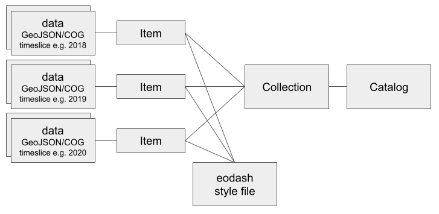
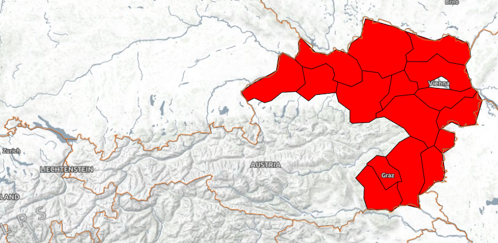

# Data configuration

An eodash instance loads its content from a STAC catalog. This catalog can be generated using the [eodash_catalog](https://github.com/eodash/eodash_catalog). As described in the [catalog wiki](https://github.com/eodash/eodash_catalog/wiki/Resource), multiple services are supported.

eodash is a data integrator. It supports a "serverless" approach, which means that you only need to make your data available online, and no complex infrastructure is needed.

We provide explanations and examples for:
* Raster data - Cloud Optimized GeoTIFFs (COGs)
* Vector data - GeoJSON or FlatGeoBuf 

To allow eodash (running in a browser) to access data from another domain, the server must return correct [CORS headers](https://developer.mozilla.org/en-US/docs/Web/HTTP/Guides/CORS). You can use [a CORS validator](https://cors-test.codehappy.dev/) - (external tool, not part of eodash) to check if the response CORS headers work correctly for access from the domain where eodash is hosted.

For both raster and vector data types, we introduced a shared styling approach. This gives you the tools to fully define how data will be rendered and interacted with. This styling is defined by a JSON configuration file that uses the languages of [OpenLayers flat style](https://openlayers.org/en/latest/apidoc/module-ol_style_flat.html) and [JSON Form](https://github.com/jsonform/jsonform/wiki#using-json-schema-to-describe-your-data-model) definition language, extended by the EOxElement [eox-jsonform](https://eox-a.github.io/EOxElements/?path=/docs/elements-eox-jsonform--docs).
The style reference for STAC as a possible extension is being discussed [here](https://github.com/radiantearth/stac-spec/issues/1284). eodash currently follows the proposed 3B approach.

Following is the catalog structure that can be generated using the [eodash_catalog](https://github.com/eodash/eodash_catalog) tool.



Datasets are referenced as assets within one item (i.e. TimeEntry) and then used in styling.

## Vector data

Example configuration for the catalog tool to add a GeoJSON file:

```json
{
  "Name": "example_collection",
  "Title": "Example collection for vector data",
  "EodashIdentifier": "exmpl1",
  "Description": "This can be **markdown** text",
  "Resources": [
    {
      "Name": "GeoJSON source",
      "Style": "https://location.of/vector_style.json",
      "Bbox": [
        9.27,
        46.2,
        17.3,
        49.2
      ],
      "TimeEntries": [
        {
          "Time": "2024",
          "Assets": [
            {
              "Identifier": "vector_data",
              "File": "https://location.of/file.json"
            }
          ]
        }
      ]
    }
  ]
}

```

([FlatGeobuf resource](https://github.com/eodash/eodash_catalog/wiki/Resource#raw-sources) would just have a different Resource Name)

Basic example of how to style vector data:
```json
{
    "fill-color": "red",
    "stroke-color": "black",
    "stroke-width": 1
}
```



For more styling options, see the  [styling guide](./styling#vector-styling).

## Raster data

Example configuration for the catalog tool to add two single band COG files.

```yaml
{
  "Name": "example_collection",
  "Title": "Example collection for raster data",
  "EodashIdentifier": "exmpl2",
  "Description": "This can be **markdown** text",
  "Resources": [
    {
      "Name": "COG source",
      "Style": "https://location.of/raster_style.json",
      "Bbox": [
        9.27,
        46.2,
        17.3,
        49.2
      ],
      "TimeEntries": [
        {
          "Time": "2024",
          "Assets": [
            {
              "Identifier": "cog1",
              "File": "https://location.of/cogfile1.tiff"
            },
            {
              "Identifier": "cog2",
              "File": "https://location.of/cogfile2.tiff"
            }
          ]
        }
      ]
    }
  ]
}

```

In eodash and OpenLayers, each COG contributes to the rendering with all its indexed bands. This needs to be accounted for in the style definition.

 * `cogfile1.tiff` - `[band, 1]`
 * `cogfile2.tiff` - `[band, 2]`

The style configuration for raster data works the same like for vector data. The only difference is using the `color` attribute do define how your raster data is rendered.

Basic example of grayscale rendering of raster values from 0 to 400 and manually filtering `No Data areas` (value 0) as transparent:
```json
{
  "color": [
    "case",
    [">", ["band", 1], 0],
    [
      "interpolate",
      ["linear"],
      ["band", 1],
      0,
      [0, 0, 0, 1],
      400,
      [255, 255, 255, 1]
    ],
    ["color", 0, 0, 0, 0]
  ]
}
```

For more raster styling options, see the [styling guide](./styling#raster-styling).

This covers the basics of "serverless" data integration. Integration of datasets provided through services do not use a style file. Each endpoint provides their own configuration options which can be defined in the data definition configuration file. For more information, see the [resource section](https://github.com/eodash/eodash_catalog/wiki/Resource) of the catalog wiki.
