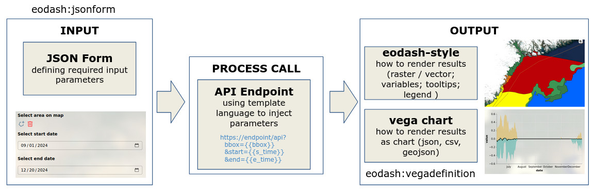
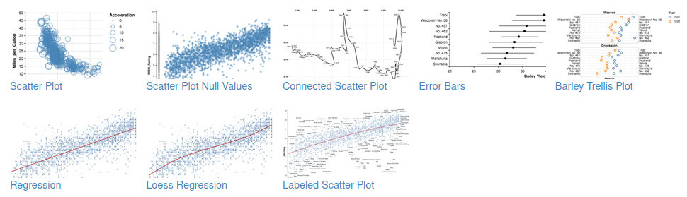
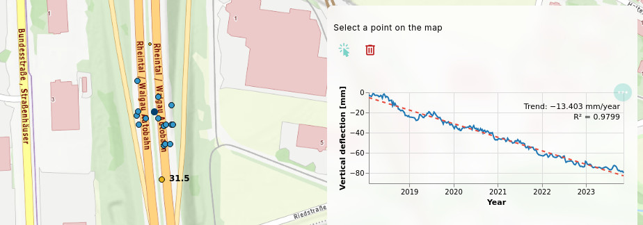

# Processing / API integration

The eodash ecosystem allows integration of almost any custom endpoint or APIs to enrich the information shown to users.

Typical use case is fetching time series or statistics for a selected area. The area can either be selected from an existing features on the map, or created by a user as a custom geometry.

The three main configuration blocks are portrayed in the figure below. They define:

* **Input**: what data the user needs to provide
* **Process call**: where is the endpoint and how inputs are sent
* **Output**: how the results are shown to the user

This means that whole definition can be done with two json files and the references in the STAC collection definition.



## Input

Inputs are defined using an **eodash:jsonform** definition. The URL to this file needs to be added in the root of the STAC collection definition or configured in the eodash_catalog collection definition.

This setup allows a broad spectrum of input fields, including custom widgets to help users select correct values. eodash uses the [eox-jsonform](https://eox-a.github.io/EOxElements/?path=/docs/elements-eox-jsonform--docs) component from EOxElements, which is based on the [json-editor](https://github.com/json-editor/json-editor) software.

A typical json-form configuration file:

```json
{
    "type": "object",
    "properties": {
        "feature_id": {
            "type": "string",
            "title": "Select feature on the map",
            "format": "feature",
            "options": {
                "drawtools": {
                    "for": "eox-map#main",
                    "layerId": "collection_layer_id"
                },
                "featureProperty": "id",
                "type": "string"
            }
        }
    },
    "options": {
        "execute": true
    }
}
```

This example lets the user click on a feature on the map. The endpoint will only need the feature `id` as a string.

The drawtool widget integration is very customizable. It allows custom point, boundnig box, or area selection. More details can be found in the [Input definition](/processing_inputs) section.

## Process call

After the inputs have been configured, you can define how they will be applied into the request.
The RESTful interfaces allow sending GET requests to retrieve the relevant information. Example  endpoint:

```
https://greatapi.com/v1/feature/timeseries/austria
```

You can insert input values into the request using templates. For example, using `feature_id` in the GET request. In eodash_catalog:

```yaml
Process:
    Name: "timeseries",
    JsonForm: "https://url.to/jsonform.json"
    VegaDefinition: "https://url.to/vega_chart.json"
    EndPoints:
        - Identifier: "timeseries"
          Url: "https://greatapi.com/v1/feature/timeseries/{{feature_id}}"
          Type: "application/json"
          Method: "GET"
```

or directly in the STAC collection as service link:

```json
{
    "rel": "service",
    "href": "https://greatapi.com/v1/feature/timeseries/{{feature_id}}",
    "type": "application/json",
    "id": "timeseries",
    "method": "GET"
},
```

## Output

The request to the endpoint will return data. In eodash, two output types exist:

* tabular, or similar structured data
* georeferenced data

### Chart data (tabular output)

For tabular data, it is possible to define a VEGA Chart. [Vega](https://vega.github.io/vega/) is a well established Visualization Grammar that allows fully custom charts.

Examples (https://vega.github.io/vega/examples/) showing what is possible with VEGA definitions:



An example definition (can be tried out in the [online editor](https://vega.github.io/editor/)):

```json
{
  "$schema": "https://vega.github.io/schema/vega-lite/v5.json",
  "data": {
    "values": [
      { "x": 1, "y": 3 },
      { "x": 2, "y": 5 },
      { "x": 3, "y": 2 }
    ]
  },
  "mark": "point",
  "encoding": {
    "x": { "field": "x", "type": "quantitative" },
    "y": { "field": "y", "type": "quantitative" }
  }
}
```
The main change needed is to remove the **data** content, and only leave the name property inside:
```json
{
  "$schema": "https://vega.github.io/schema/vega-lite/v5.json",
  "data": {
    "name": "timeseries"
  },
  ...
}
```
The data section will be filled by eodash.

### Georeferenced data

For georeferenced data, like Cloud optimized **Geotiffs (COGs), GeoJSON or FlatGeobuf**, you can define an **eodash:style**.
See the [Styling](/styling) section for details.

You can specify multiple endpoints, e.g. one providing timeseries, and another providing GeoJSON with location data. Example:



