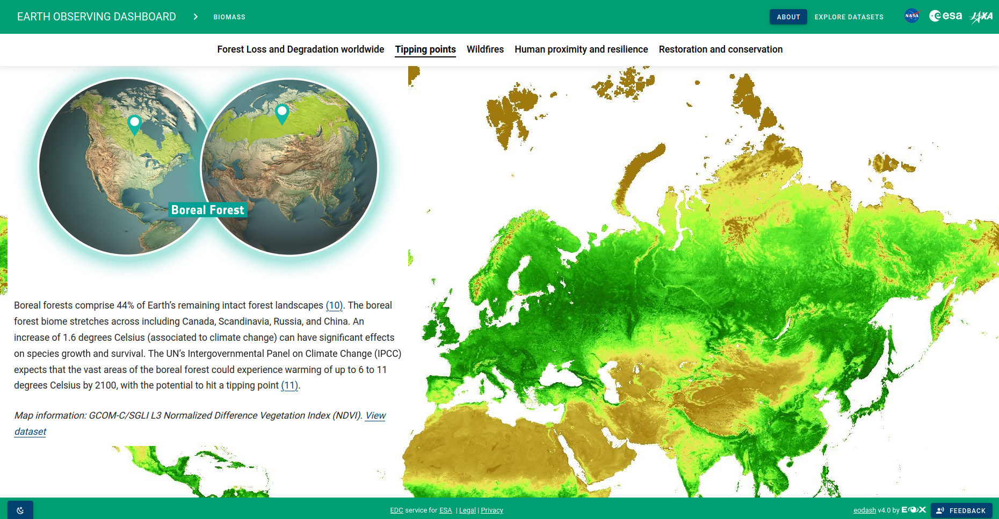

# Storytelling

Storytelling is a tool provided by EOxElements. It is an editor and renderer based on Markdown. It allows integration of the same widgets as used in eodash.
The Markdown is extended by allowing special configuration expressions that are evaluated to setup and show the different widgets. The great aspect is that the Markdown file can still be displayed by any normal Markdown interpreter, so the stories written can be still utilized across many frameworks.



We want to make sure information to a wider audience can be presented in a guided and understandable manner, for within the core functionality of eodash we want to provide easy ways to export the state of the dashboard to be easily added to a story.

An instance of the story editor can be deployed independently, you can have a look at an example in the EOxElement documentation [here](https://eox-a.github.io/EOxElements/?path=/story/elements-eox-storytelling--markdown-with-editor#section-why-storytelling). You can open and directly edit the information shown by clicking the toggle button on the bottom right. The example story already describes many of the capabilities

An example on how to export the state of an eodash instance would look like this:
```
## Map Example <!--{as="eox-map" style="width: 100%; height: 500px;" layers='[{"type":"Tile","properties":{"id":"Overlay labels"},"source":{"type":"XYZ","urls":["//s2maps-tiles.eu/wmts/1.0.0/overlay_base_bright_3857/default/g/{z}/{y}/{x}.jpg"]}},{"type":"Tile","properties":{"id":"NO2-2023-11-28T00:00:00Z"},"source":{"type":"TileWMS","urls":["https://eccharts.ecmwf.int/wms/?token=public&"],"params":{"layers":"composition_europe_no2_analysis_surface","styles":"sh_OrangesTransparent40_surface_concentration","format":"image/png","time":"2023-11-28T00:00:00Z"}}},{"type":"Tile","properties":{"id":"Terrain light"},"source":{"type":"XYZ","urls":["//s2maps-tiles.eu/wmts/1.0.0/terrain-light_3857/default/g/{z}/{y}/{x}.jpg"]}}]' zoom="4.932639746597878" center=[9.143518788034312,44.52383030819641] }-->
``` 

You can paste this code directly into the storytelling editor linked above.

Once a content creator is happy with the story, it can be exported as Markdown file and added as rendered version to an eodash instance. An example of how these stories could be added is shown in the [eodash-pages-template](https://github.com/eodash/eodash-pages-template).
