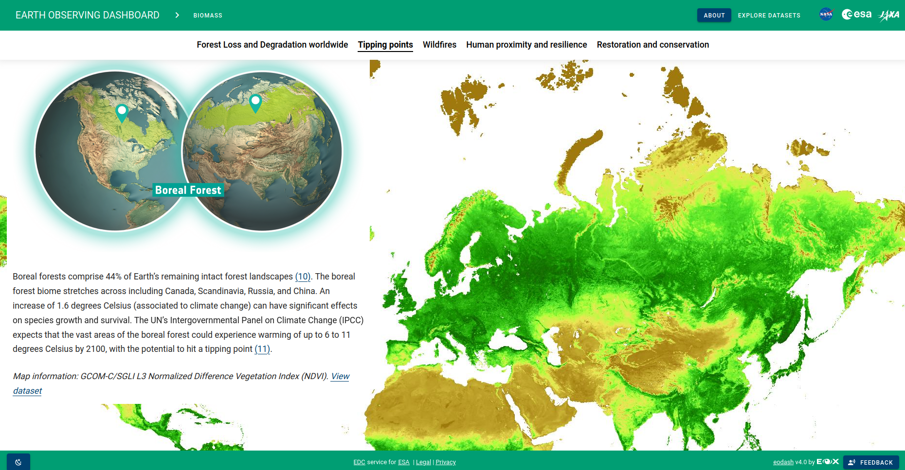

# Storytelling

Storytelling is a tool provided by EOxElements. It is a Markdown-based editor and renderer that allows integration of the same widgets as used in eodash.
The Markdown is extended by allowing special configuration expressions that are evaluated to setup and show the different widgets. The main advantage is that the Markdown file can still be displayed by any common Markdown interpreter, so the stories can still be used across many frameworks.



The goal is to present information to a wider audience in a clear, guided way. eodash supports this by allowing you to export the current dashboard state and easily include it in a story.

An instance of the story editor can be deployed independently. See details of an example in the EOxElement documentation [here](https://eox-a.github.io/EOxElements/?path=/story/elements-eox-storytelling--markdown-with-editor#section-why-storytelling). You can edit content directly in the editor by using the toggle button in the bottom right. The example story demonstrates many of the available features.

An example of exporting the state of an eodash instance:
```
## Map Example <!--{as="eox-map" style="width: 100%; height: 500px;" layers='[{"type":"Tile","properties":{"id":"Overlay labels"},"source":{"type":"XYZ","urls":["//s2maps-tiles.eu/wmts/1.0.0/overlay_base_bright_3857/default/g/{z}/{y}/{x}.jpg"]}},{"type":"Tile","properties":{"id":"NO2-2023-11-28T00:00:00Z"},"source":{"type":"TileWMS","urls":["https://eccharts.ecmwf.int/wms/?token=public&"],"params":{"layers":"composition_europe_no2_analysis_surface","styles":"sh_OrangesTransparent40_surface_concentration","format":"image/png","time":"2023-11-28T00:00:00Z"}}},{"type":"Tile","properties":{"id":"Terrain light"},"source":{"type":"XYZ","urls":["//s2maps-tiles.eu/wmts/1.0.0/terrain-light_3857/default/g/{z}/{y}/{x}.jpg"]}}]' zoom="4.932639746597878" center=[9.143518788034312,44.52383030819641] }-->
``` 

You can paste this code directly into the storytelling editor linked above.

Once the story is ready, it can be exported as Markdown file and added as rendered version to an eodash instance. An example of how these stories can be added is available in the [eodash-pages-template](https://github.com/eodash/eodash-pages-template).
