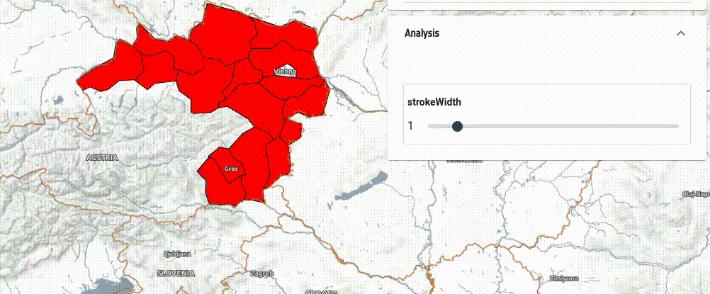
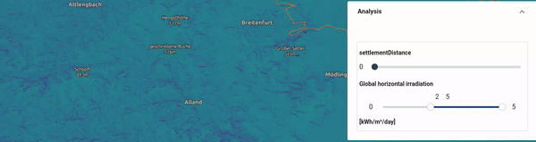

# Styling

For both vector and raster data, eodash uses a shared JSON style definition with use of [OpenLayers flat style](https://openlayers.org/en/latest/apidoc/module-ol_style_flat.html) and [JSON Form](https://github.com/jsonform/jsonform/wiki#using-json-schema-to-describe-your-data-model) definition language as extended by the EOxElement [eox-jsonform](https://eox-a.github.io/EOxElements/?path=/docs/elements-eox-jsonform--docs) and [eox-layercontrol-legend]()

## Vector styling

Basic example:
```json
{
    "fill-color": "red",
    "stroke-color": "black",
    "stroke-width": 1
}
```

### Changing style UI


You can add user controls by combining style variables with JSON Form. Example of adjustable stroke width:
```json
{
    "variables": {
        "strokeWidth": 1
    },
    "fill-color": "red",
    "stroke-color": "black",
    "stroke-width": ["var", "strokeWidth"],
    "jsonform": {
        "type": "object",
        "title": "Data configuration",
        "properties": {
          "strokeWidth": {
            "type": "number",
            "minimum": 0,
            "maximum": 10,
            "format": "range",
            "default": 0
          }
        }
    }
}
```

The name of variable `strokeWidth` must match in `variables` object, variable inside the flatstyle properties `(stroke-width)`, and `jsonform.properties`.



### Tips and tricks

Taking these concepts into account, one can extend the style to use also the `get` functionality of flat styles to access feature properties of the geoJSON and [encoded expressions](https://openlayers.org/en/latest/apidoc/module-ol_expr_expression.html#~EncodedExpression) truly custom and interactive styles can be created.

There are a few interesting tricks for properties, which "somehow do not fit".

Convert numbers to strings:
`to-string` or `concat`:

`"text-value": ["to-string", ["get", "numberproperty"]],`

`"text-value": ["concat", ["get", "numberproperty"], "somestring, e.g. unit of measurement"],`

If a property is null, styling may fail. Use coalesce:

Therefore if the feature property is null it will return "N/A" in this case

 `"text-value": ["to-string",["coalesce", ["get", "propertywithsomenullvalues"], "N/A"]],`.

Nested properties:
```json
{
   "text-value":[
      "to-string",
      [
         "coalesce",
         [
            "get",
            "topproperty",
            "subproperty",
            "subsubproperty"
         ],
         "N/A"
      ]
   ]
}
```

### Other examples

Example of color range applied to style Ice charts data according to the `Sea Ice Concentration` percentage with values 0-100.

```json
{
  "tooltip": [{"id": "CT", "title": "CT"}],
  "fill-color": [
    "case",
    ["!", ["get", "CT"]],
    [0, 0, 0, 0],
    ["<", ["get", "CT"], 0],
    [0, 0, 255, 0],
    ["<=", ["get", "CT"], 10],
    [150, 200, 255, 1],
    ["<=", ["get", "CT"], 40],
    [140, 255, 159, 1],
    ["<=", ["get", "CT"], 70],
    [255, 255, 0, 1],
    ["<=", ["get", "CT"], 90],
    [255, 125, 7, 1],
    ["<=", ["get", "CT"], 100],
    [255, 0, 0, 1],
    [0, 0, 255, 1]
  ],
  "stroke-color": "black",
  "stroke-width": 1
}

```

### Hidden fields

You can hide fields via `"options": {"hidden": true},`to create "composed" fields to be later reused in the styles.

In this example a tooltip content is created from a hidden field, which is a composite of values from three other selection fields `ship_class`, `type_of_ice` and `type_of_visualization` via a `watch` syntax. Also see `enum_titles` property for human readable labels of fields.

```json
{
    "jsonform": {
        "type": "object",
        "title": "Data configuration",
        "properties": {
            "type_of_visualisation": {
                "title": "Type of Visualisation",
                "type": "string",
                "enum": [
                    "airss",
                    "WMO Concentration"
                ],
                "options": {
                    "enum_titles": [
                        "AIRSS Ice Numeral Go/No Go",
                        "WMO Concentration"
                    ]
                },
                "default": "airss"
            },
            "ship_class": {
                "title": "Ship Class",
                "type": "string",
                "enum": [
                    "type_a",
                    "type_b",
                    "type_c",
                    "type_d",
                    "type_e",
                    "type_cac3",
                    "type_cac4"
                ],
                "options": {
                    "enum_titles": [
                        "Type A",
                        "Type B",
                        "Type C",
                        "Type D",
                        "Type E",
                        "Type CAC3",
                        "Type CAC4"
                    ]
                },
                "default": "type_a"
            },
            "type_of_ice": {
                "title": "Type of Ice (decayed/standard)",
                "type": "string",
                "enum": ["standard", "ridged"],
                "default": "standard"
            },
            "combined_prop": {
                "type": "string",
                "template": "{{vis}}_{{ice}}_{{ship}}_go_no_go",
                "options": {"hidden": true},
                "watch": {
                    "vis": "type_of_visualisation",
                    "ice": "type_of_ice",
                    "ship": "ship_class"
                }
            }
        }
    },
    "tooltip": [
        {"id": "wmo_concentration", "title": "WMO Concentration"},
        {"id": "wmo_stage_of_development", "title": "Stage of development"},
        {
            "id": "{{combined_prop}}",
            "title": "AIRSS value (ship class: {{ship_class}} ice: {{type_of_ice}})"
        }
    ],
    "variables": {
        "ship_class": "type_a",
        "type_of_ice": "standard",
        "type_of_visualisation": "airss",
        "combined_prop": "airss_standard_type_a_go_no_go"
    },
    "fill-color": [
        "case",
        ["==", ["var", "type_of_visualisation"], "WMO Concentration"],
        [
            "match",
            ["get", "wmo_concentration"],
            "Ice Free",
            [0, 100, 255, 1],
            "Open Water (< 1/10 ice)",
            [150, 200, 255, 1],
            "Bergy Water",
            [150, 200, 255, 1],
            "1/10 - 3/10",
            [140, 255, 160, 1],
            "4/10 - 6/10",
            [255, 255, 0, 1],
            "7/10 - 8/10",
            [255, 125, 5, 1],
            "9/10 - 10/10",
            [255, 0, 0, 1],
            "8/10 - 9/10",
            [255, 0, 0, 1],
            "8/10 - 10/10",
            [255, 0, 0, 1],
            "7/10 - 9/10",
            [255, 125, 7, 1],
            "6/10 - 7/10",
            [255, 125, 7, 1],
            "5/10 - 7/10",
            [255, 255, 0, 1],
            "3/10 255 5/10",
            [255, 255, 0, 1],
            "3/10 255 4/10",
            [255, 255, 0, 1],
            "2/10 255 4/10",
            [255, 255, 0, 1],
            "Unknown/Undetermined",
            [255, 255, 255, 1],
            [255, 255, 255, 1]
        ],
        ["==", ["var", "type_of_visualisation"], "airss"],
        [
            "case",
            ["==", ["get", "polygon_type"], "Ice Free"],
            [0, 100, 255],
            ["==", ["get", ["var", "combined_prop"]], "<= 0 IN < 2"],
            [217, 239, 139, 1],
            ["==", ["get", ["var", "combined_prop"]], "<= 2 IN < 5"],
            [166, 217, 106, 1],
            ["==", ["get", ["var", "combined_prop"]], "<= 5 IN < 10"],
            [102, 189, 99, 1],
            ["==", ["get", ["var", "combined_prop"]], "IN > 10"],
            [26, 152, 80, 1],
            ["==", ["get", ["var", "combined_prop"]], "<= -2 IN < 0"],
            [255, 135, 135, 1],
            ["==", ["get", ["var", "combined_prop"]], "<= -5 IN < -2"],
            [255, 82, 82, 1],
            ["==", ["get", ["var", "combined_prop"]], "<= -10 IN < -5"],
            [255, 0, 0, 1],
            [0, 0, 0, 1]
        ],
        [0, 0, 0, 1]
    ],
    "stroke-color": "black",
    "stroke-width": 1
}
```

## Raster styling

Here is a more complex example which shows the use of `["band", 1]` to access values from two single band COGs, normalizing the data to 0-1 values, and then applying an interpolated 16-value viridis colormap. The vmin and vmax variables are used to perform the normalization allowing dynamic color range adaptation in the eodash instance.

Band 2 is used to filter what data gets rendered. If the case does not apply, it renders the corresponding pixel as transparent.

Additionally, a dynamic legend is defined by using the `domainProperties` referencing the `jsonform` and `style` variables `vmin` and `vmax`. These properties can be named differently for other datasets, but must end with `min` and `max`. Hex color code (`#ff00ff`) strings can be used, too, for both `legend` and `color`.

```json
{
    "variables": {
      "vmin": 2,
      "vmax": 5,
      "settlementDistance": 0
    },
    "color": [
        "case",
        [
            "all",
            [">", ["band", 1], 1],
            [">=", ["band", 2], ["var", "settlementDistance"]]
        ],
        [
            "interpolate",
            ["linear"],
            ["/", ["-", ["band", 1], ["var", "vmin"]], ["-", ["var", "vmax"], ["var", "vmin"]]],
            0, [68, 1, 84, 1],
            0.067, [70, 23, 103, 1],
            0.133, [71, 44, 122, 1],
            0.2, [65, 63, 131, 1],
            0.266, [59, 81, 139, 1],
            0.333, [52, 97, 141, 1],
            0.4, [44, 113, 142, 1],
            0.467, [39, 129, 142, 1],
            0.533, [33, 144, 141, 1],
            0.6, [39, 173, 129, 1],
            0.666, [66, 187, 114, 1],
            0.733, [92, 200, 99, 1],
            0.8, [131, 210, 75, 1],
            0.867, [170, 220, 50, 1],
            0.933, [212, 226, 44, 1],
            1, [253, 231, 37, 1]
        ],
        [
        "color", 0, 0, 0, 0
        ]
    ],
    "legend": {
        "title": "[kWh/m²/day]",
        "range": [
            "rgba(68, 1, 84, 1)",
            "rgba(70, 23, 103, 1)",
            "rgba(65, 63, 131, 1)",
            "rgba(59, 81, 139, 1)",
            "rgba(52, 97, 141, 1)",
            "rgba(44, 113, 142, 1)",
            "rgba(39, 129, 142, 1)",
            "rgba(33, 144, 141, 1)",
            "rgba(39, 173, 129, 1)",
            "rgba(66, 187, 114, 1)",
            "rgba(92, 200, 99, 1)",
            "rgba(131, 210, 75, 1)",
            "rgba(170, 220, 50, 1)",
            "rgba(212, 226, 44, 1)",
            "rgba(253, 231, 37, 1)"
        ],
        "domainProperties": ["vmin", "vmax"]
    },
    "jsonform": {
      "type": "object",
      "title": "Data configuration",
      "properties": {
        "settlementDistance": {
            "type": "number",
            "minimum": 0,
            "maximum": 5000,
            "format": "range",
            "default": 0
        },
        "vminmax": {
          "title": "Global horizontal irradiation",
          "description": "[kWh/m²/day]",
          "type": "object",
          "properties": {
            "vmin": {
              "type": "number",
              "minimum": 0,
              "maximum": 5,
              "format": "range",
              "default": 2
            },
            "vmax": {
              "type": "number",
              "minimum": 0,
              "maximum": 5,
              "format": "range",
              "default": 5
            }
          },
          "format": "minmax"
        }
      }
    }
  }
```
Here is how that translates to a visualization in the eodash instance (without the legend):




### Controlling which bands to use via UI

Style `variables` and `jsonform` can be used to let user switch between bands or data properties.

The following style allows accessing 6 hourly predictions of Ice drift from Sentinel-1 scenes over the same area of interest and adapting color stretch:

```json
{
    "legend": {
        "title": "S1 Scene",
        "range": [
            "rgba(0, 0, 0, 1)",
            "rgba(255, 255, 255, 1)"
        ],
        "domainProperties": ["vmin", "vmax"]
    },
    "variables": {
        "vmin": 0,
        "vmax": 1000,
        "prediction_hour": 1
    },
    "color": [
        "case",
        [">", ["band", ["var", "prediction_hour"]], 0],
        [
            "interpolate",
            ["linear"],
            [
                "/",
                ["-", ["band", ["var", "prediction_hour"]], ["var", "vmin"]],
                ["-", ["var", "vmax"], ["var", "vmin"]]
            ],
            0,
            [0, 0, 0, 1],
            1,
            [255, 255, 255, 1]
        ],
        ["color", 0, 0, 0, 0]
    ],
    "jsonform": {
        "type": "object",
        "title": "Data configuration",
        "properties": {
            "prediction_hour": {
                "type": "number",
                "minimum": 1,
                "maximum": 6,
                "step": 1,
                "format": "range",
                "default": 1
            },
            "vminmax": {
                "title": "S1 warped predictions",
                "type": "object",
                "properties": {
                    "vmin": {
                        "type": "number",
                        "minimum": 0,
                        "maximum": 3000,
                        "format": "range",
                        "default": 0
                    },
                    "vmax": {
                        "type": "number",
                        "minimum": 0,
                        "maximum": 3000,
                        "format": "range",
                        "default": 1000
                    }
                },
                "format": "minmax"
            }
        }
    }
}
```
