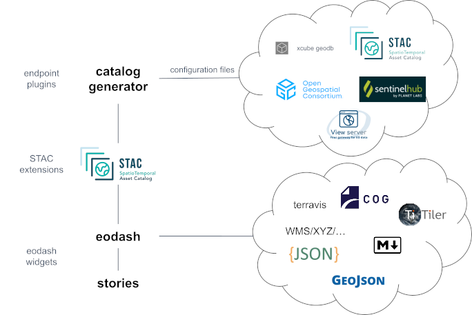

# Welcome

Great to see you are interested in learning more about the eodash ecosystem! 

Firstly a quick note: the components do not have a stable release and the documentation is also being worked on, so updates and changes are very much to be expected!

## Goal
With this ecosystem we want to provide an easily usable, configurable and extendable toolset to present results and achievements around the earth observation domain online and accessible.

We want to establish this ecosystem by collaborating with the different EO communities and understanding their requirements, trying to set it up as a more open community project to foster communication.

The core functionality of the toolset should cater to provide a baseline that can be used by each of these communities but still allowing to easily integrate their unique solutions.

The documentation tries to cater two user groups:
  - Service administrators looking into how to setup or integrate the eodash ecosystem into their environments, providing an extended service to other users
  - Members of a community and users of an extended service suite where the eodash ecosystem has been integrated to provide information on how to integrate their data and results

## What is the eodash ecosystem?

The eodash ecosystem is an aggregation of tools provided in a permissive license conceptualized around [SpatioTemporal Asset Catalogs (STAC)](https://stacspec.org) that work well together and in a federated way to provide the basis to integrate Earth Observation data into an overarching service package.
The main tools are a web client dashboard library (eodash) as well as a catalog generator library that provide the basis for integration of many types of endpoints.

## Concept

The figure above shows the main components of the eodash ecosystem, as well as how they interact with each other.

The **eodash [catalog](https://github.com/eodash/eodash_catalog)** is a helper python package which supports a series of commonly used serverless EO data endpoints as well as service endpoints, such as [OGC](https://www.ogc.org/) services, [ViewServer](https://gitlab.eox.at/vs), STAC catalogs, and others.
By defining a collection configuration file an end user can provide a wide range of visualization and analysis definitions to describe how the data should be visualized on the eodash web client. The supported resources are described [here](https://github.com/eurodatacube/eodash-catalog/wiki/Resource). The output of the catalog helper package is a static catalog (series of files), that can be hosted on any web server.

The generated static catalog is the input used by an **[eodash](https://eodash.github.io/eodash/)** instance to populate the information shown. This includes descriptive text, assets, analysis functions and most importantly customizable EO data visualization through a series of configurable widgets. eodash provides a set of **core widgets** that can be configured to navigate and interact with the data. Third party widgets can be developed and integrated through the configuration by (for example) reacting to specific **STAC extensions** in the catalog.

For wider audiences the [storytelling](https://eox-a.github.io/EOxElements/?path=/docs/elements-eox-storytelling--docs) component is envisioned. It provides an online editor (based on [Markdown](https://www.markdownguide.org/)) to create an interactive and guided experience. Results and datasets shown in eodash instances can be easily integrated. Field experts and communicators are able to create such content by utilizing the capabilities provided by eodash.

