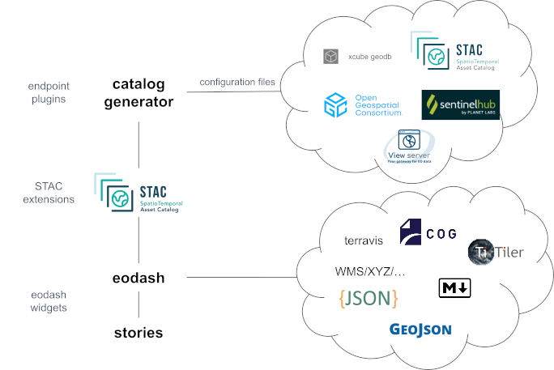

# Welcome

Welcome to EO Dash documentation. 

Note: the components do not have a stable release and the documentation is also being worked on, so updates and changes are to be expected.

## Goal
With the eodash ecosystem, we provide a set of tools that work well together. It is a federated system based around SpatioTemporal Asset Catalogs: STAC that allows the individual setup that is needed by most projects and communities. 

These components and concepts are developed under a permissive license in the hope of extending the user base for them and growing their capabilities together through either external extensions or plugins, or by contributions or feedback to improve the core tools.
The eodash ecosystem provides an easily usable, configurable and extendable toolset to present results and achievements around the earth observation domain online and accessible.

We invite EO communities to collaborate on this project to establish this ecosystem by understanding their requirements, fostering communication and building on common goals.

The core functionality defines a baseline intended for use by each community while still allowing easy integration of their unique solutions.

The documentation serves two user groups:
  - Service administrators looking into setting up or integrating the eodash ecosystem into their environments, providing an extended service to other users.
  - Members of the community and users of the extended service suite, where the eodash ecosystem is integrated and provides guidance on how to combine their data and results.

## What is the eodash ecosystem?

The eodash ecosystem is a set of open-source tools built around [SpatioTemporal Asset Catalogs (STAC)](https://stacspec.org). These tools work together to help integrate Earth Observation data into a broader service package.

The main tools are a web client dashboard library (eodash) and a catalog generator library, which support integration of many types of endpoints.

## Concept

The figure above shows the main components of the eodash ecosystem and how they interact with each other.

The **eodash [catalog](https://github.com/eodash/eodash_catalog)** is a helper Python package, which supports a series of commonly used serverless Earth Observation (EO) data endpoints, as well as service endpoints such as [OGC](https://www.ogc.org/) services, [ViewServer](https://gitlab.eox.at/vs), STAC catalogs, and others.
By defining a collection configuration file, end users can specify a wide range of visualization and analysis definitions that describe how the data should be visualized on the eodash web client. The supported resources are described [here](https://github.com/eodash/eodash_catalog/wiki/Resource). The output of the catalog helper package is a static catalog (series of files) that can be hosted on any web server.

The generated static catalog is then used as input by an **[eodash](https://eodash.github.io/eodash/)** instance to populate the displayed information. This includes descriptive text, assets, analysis functions, and most importantly, customizable EO data visualization through a set of configurable widgets. eodash provides **core widgets** that can be configured to explore and interact with the data. Third-party widgets can be developed and integrated through the configuration, for example by reacting to specific **STAC extensions** in the catalog.

For wider audiences, the [storytelling](https://eox-a.github.io/EOxElements/?path=/docs/elements-eox-storytelling--docs) component is designed to provide an interactive and guided experience. It includes an online editor (based on [Markdown](https://www.markdownguide.org/)) to create such content. Results and datasets shown in eodash instances can be easily integrated. Field experts and communicators can create such content by using the capabilities provided by eodash.

