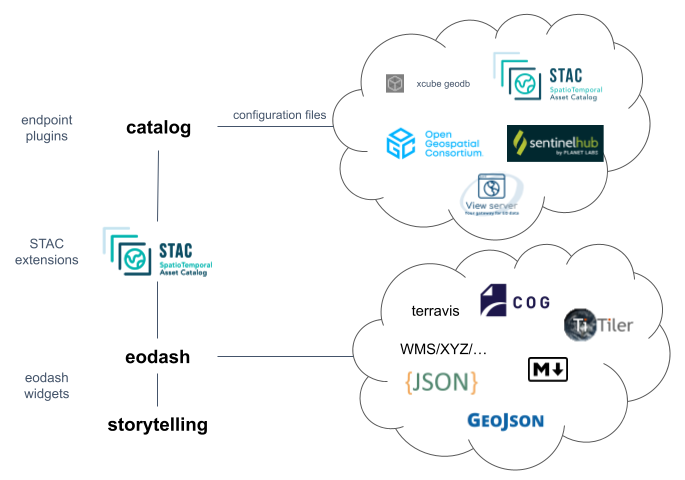

# Welcome

Great to see you are interested in learning more about the eodash ecosystem! 

Firstly a quick note: the components do not have a stable release and the documentation is also being worked on, so updates and changes are very much to be expected!

With this documentation we want to cater two user groups:
  - System administrators looking into how to setup or integrate the eodash ecosystem into their environments, providing an extended service to other users
  - Members of a community and users of an extended service suite where the eodash ecosystem has been integrated to understand how to integrate their data and results

## What is the eodash ecosystem?

The eodash ecosystem is an aggregation of tools provided in a permissive license conceptualized around STAC that work well together and in a federated way to provide the basis to integrate Earth Observation data into an overarching service package.
The main tools are a web client dashboard library (eodash) as well as a catalog generator library that provide the basis for integration of many types of endpoints.

## Concept

